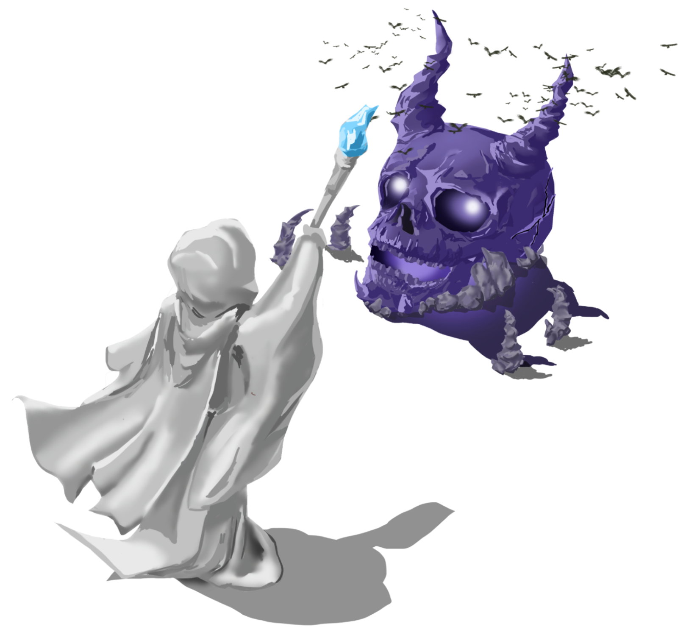

  

## Teamforce Game

Teamforce game is aimed at the next generation MOBA game, focusing more on collaboration than current MOBA games.

  

### Gameplay Overview

- One Evil Lord vs. four Heroes
- Three routes between the Hero base and the Evil Lord base 
- Each side has a tower on each route for defense
- Each side regularly sends out minion troops to attack
- Monsters in the middle of the island for resources

### Networking Overview

- **Mirror Networking** high-level API for multiplayer game in unity
- Low-level sockets to build lobby server
- **Kerberos**-inspired authentication system
- **Azure** to host game servers
- **MongoDB** to save user account information

### Demo
<iframe width="560" height="315" src="https://www.youtube.com/embed/sacSEKXDhgI" title="YouTube video player" frameborder="0" allow="accelerometer; autoplay; clipboard-write; encrypted-media; gyroscope; picture-in-picture" allowfullscreen></iframe>

### Team

[Dehao Tu](https://www.linkedin.com/in/dehaotu/)

[Tin Hang Chui](https://www.linkedin.com/in/tin-hang-chui/)

[Jungwon Yoon](https://www.linkedin.com/in/foggyoon/)

[Lyuchun Huang](https://www.linkedin.com/in/lyuchun-huang/)

[Ruoxuan Wang](https://www.linkedin.com/in/ruoxuan-wang-311917a1/)

[Yaqi Han](https://www.linkedin.com/in/yaqihan/)

[Yijing Yang](https://www.linkedin.com/in/yijing-yang-02377317b/)

### Documents
[EDD]()
[Technical Paper]()

---

Special thanks to Professor Zyda, Powen Yao, Shrey Nahar, and artist__.

